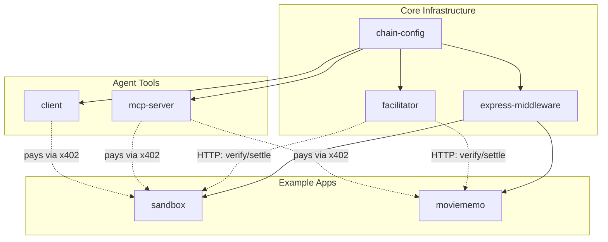

# Conflux x402 Toolkit

A developer toolkit for running x402 payments on Conflux eSpace mainnet with USDT0.

## What is implemented

- End-to-end x402 payment flow on Conflux (`eip155:1030`)
- Custom facilitator service (`verify` / `settle` / `supported`)
- Express API examples with protected paid routes (`/sandbox/*`, `/api/*`)
- MCP server tool for agent-driven x402 payments
- Client auto-payment mode (automatic `402 -> sign -> retry`)
- Client manual-payment mode (user confirms before signing)
- Safety controls: allowlist, limits, verify-only switch, circuit breaker

## Architecture



## Repository layout

- **Core (`packages/`)**
  - `packages/chain-config` - chain/token constants and shared types
  - `packages/facilitator` - facilitator service
  - `packages/express-middleware` - shared x402 Express middleware
- **Tools (`tools/`)**
  - `tools/mcp-server` - MCP server for agent payments
  - `tools/client` - auto/manual payment clients
- **Examples (`examples/`)**
  - `examples/sandbox` - minimal x402-protected API
  - `examples/moviememo` - MovieMemo paid API demo

## Quick start

1. Install dependencies:

```bash
pnpm install
```

2. Create and fill environment file:

```bash
cp .env.example .env
```

Required values:

- `FACILITATOR_PRIVATE_KEY` (with `0x` prefix)
- `CLIENT_PRIVATE_KEY` (with `0x` prefix)
- `EVM_ADDRESS` (payee address)

3. Start services:

```bash
pnpm dev:facilitator
pnpm dev:sandbox
```

## Client modes

### Auto mode

```bash
pnpm start:client
```

### Manual mode

```bash
pnpm start:client:manual
```

Manual mode first fetches a `402` response, prints payment requirements, and waits for explicit user confirmation (`yes/no`) before signing and retrying.

## Notes

- Network: Conflux eSpace Mainnet (`eip155:1030`)
- Token: USDT0
- `VERIFY_ONLY_MODE=true` validates signatures only; no on-chain settlement
- Set `VERIFY_ONLY_MODE=false` to execute real settlement transactions
